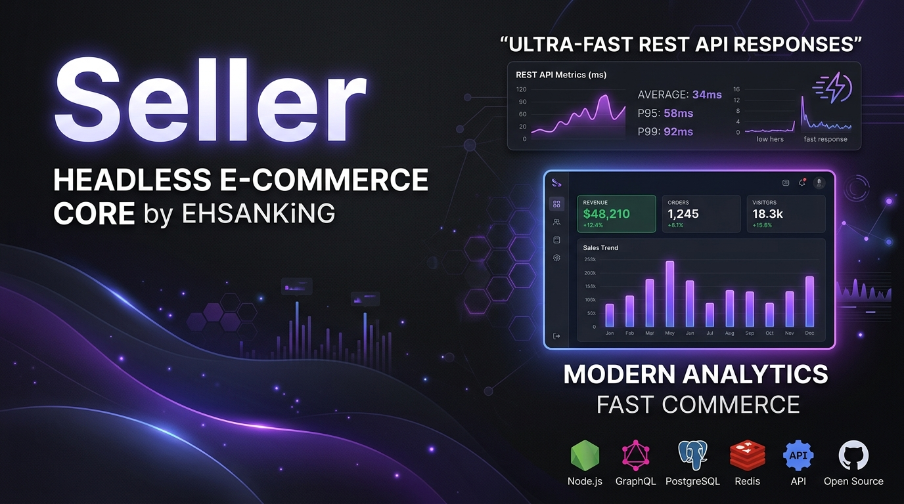
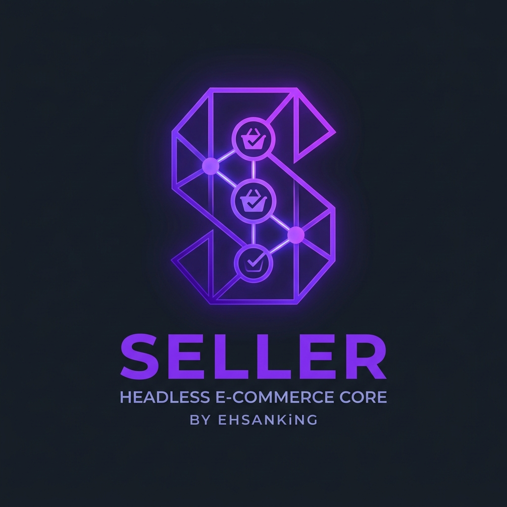

<p align="center">
  
</p>

<p align="center">
  
</p>

<h1 align="center">SELLER Core — Enterprise Headless E-Commerce Engine</h1>

<p align="center">
  <strong>The Ultimate High-Performance, Modular, Open-Source Headless Commerce Infrastructure</strong><br>
  Empowering small businesses, independent merchants, and software engineers worldwide — <strong>100% Free Forever</strong>.
</p>

<p align="center">
  <a href="https://github.com/ehsanking/seller"></a>
  <a href="https://github.com/ehsanking/seller"></a>
  <a href="https://github.com/ehsanking/seller"></a>
  <a href="https://github.com/ehsanking/seller"></a>
  <a href="https://github.com/ehsanking/seller"></a>
</p>

---

## 🌐 Mission & Vision: Democratic Commerce Without Software Tax

In today’s digital economy, small business owners and independent entrepreneurs are burdened by escalating monthly SaaS subscription fees, transaction cut percentages, forced cloud migrations, and locked-in proprietary vendor ecosystems.

**SELLER Core** was architected from the ground up by **EHSANKiNG** to dismantle these financial barriers permanently.

> ### 📢 Our Immutable Commitment:
> **SELLER Core is, and will forever remain, 100% Free and Open-Source.**
> There are no hidden paywalls, no monthly subscription tiers, no transaction cuts, and zero vendor lock-in. You own your data, your infrastructure, your storefront codebase, and your business destiny.

---

## ⚡ One-Line Automatic Installation

Deploy the complete SELLER Headless Core engine on any Linux server, Cloud VM, or Docker container with a single terminal command:

```bash
curl -sSL https://raw.githubusercontent.com/ehsanking/seller/main/install.sh | bash
```

### 🐳 Docker One-Liner Execution:
```bash
docker run -d -p 3000:3000 --name seller-core ehsanking/seller:latest
```

---

## 🎨 Storefront Template Engine & Multi-Framework Support

SELLER Core is built upon a **100% Decoupled Headless Architecture**. The core application serves high-speed RESTful JSON APIs, enabling complete freedom in choosing your frontend technology stack.

We support and provide starter storefront implementations across major modern web frameworks:

```
├── storefronts/
│   ├── react-tailwind/        # React 18 + Vite + Tailwind CSS Storefront
│   ├── vue-tailwind/          # Vue 3 Composition API + Pinia Storefront
│   ├── bootstrap5/            # Zero-Build HTML5 + Bootstrap 5 Lightweight Theme
│   └── nextjs-app-router/     # Next.js 14 App Router + Server Actions + ISR
```

---

## 🛠️ Comprehensive Developer Tutorial: Building Custom Storefront Templates

SELLER Core makes creating and uploading custom storefront themes effortless. Any frontend developer can craft a custom theme using their preferred framework and register it in the SELLER Control Panel.

### 1. Storefront Manifest Format (`template.json`)
Create a `template.json` file inside your storefront root folder or upload it through the Admin Control Panel:

```json
{
  "name": "Cyberpunk Neon Headless Theme",
  "slug": "cyberpunk-neon-theme",
  "description": "A high-contrast, dark luxury e-commerce theme designed for electronics and modern gadgets.",
  "framework": "React",
  "author": "EHSANKiNG",
  "version": "1.0.0",
  "previewImage": "https://images.unsplash.com/photo-1550745165-9bc0b252726f?auto=format&fit=crop&w=600&q=80",
  "repoUrl": "https://github.com/ehsanking/seller-cyberpunk-theme",
  "demoUrl": "https://cyberpunk-demo.ehsan-store.io",
  "features": [
    "Dark Luxury Theme",
    "Cart Drawer Animation",
    "Instant Stripe Webhooks",
    "Responsive Grid"
  ]
}
```

---

### 2. Framework Integration Tutorials

#### 🅰️ Building a React 18 + Tailwind Storefront
In React, use standard `fetch` or `axios` to query SELLER REST endpoints:

```tsx
// src/hooks/useSellerProducts.ts
import { useEffect, useState } from 'react';

export function useSellerProducts() {
  const [products, setProducts] = useState([]);

  useEffect(() => {
    fetch('http://localhost:3000/api/products')
      .then(res => res.json())
      .then(data => setProducts(data))
      .catch(console.error);
  }, []);

  return { products };
}
```

#### 🅱️ Building a Vue 3 + Pinia Storefront
In Vue 3 Composition API, create a reactive Pinia store:

```ts
// stores/catalog.ts
import { defineStore } from 'pinia';

export const useCatalogStore = defineStore('catalog', {
  state: () => ({ products: [] }),
  actions: {
    async fetchProducts() {
      const res = await fetch('http://localhost:3000/api/products');
      this.products = await res.json();
    }
  }
});
```

#### Ⓒ Building a Bootstrap 5 Zero-Build Storefront
For instant zero-npm setup, embed vanilla JavaScript in HTML:

```html
<script>
  async function renderStore() {
    const res = await fetch('http://localhost:3000/api/products');
    const products = await res.json();
    document.getElementById('catalog').innerHTML = products.map(p => `
      <div class="col-md-4">
        <div class="card h-100 p-3">
          <h5>${p.title}</h5>
          <p class="text-primary font-weight-bold">$${p.price}</p>
        </div>
      </div>
    `).join('');
  }
  renderStore();
</script>
```

#### Ⓓ Building a Next.js 14 App Router Storefront
Use Next.js Server Components with automatic revalidation:

```tsx
// app/page.tsx
export default async function HomePage() {
  const res = await fetch('http://localhost:3000/api/products', {
    next: { revalidate: 60 } // Incremental Static Regeneration (ISR)
  });
  const products = await res.json();

  return (
    <main className="max-w-7xl mx-auto p-8">
      <h1 className="text-3xl font-bold">Featured Catalog</h1>
      <div className="grid grid-cols-3 gap-6 mt-6">
        {products.map((p: any) => (
          <div key={p.id} className="border p-4 rounded-xl">
            <h3 className="font-bold">{p.title}</h3>
            <p className="text-indigo-600 font-extrabold">${p.price}</p>
          </div>
        ))}
      </div>
    </main>
  );
}
```

---

## 🧩 Extension, Plugin & Template Ecosystem & Commercial Freedom

SELLER Core provides an event-driven plugin architecture that allows developers to extend payment gateways, logistics services, and AI automation tools without touching core backend source files.

> ### 💼 Commercial Policy: Custom Plugins & Templates Monetization
> **Designing custom plugins, specialized integrations, and unique storefront templates and selling them commercially is 100% permitted, legal, and encouraged!** 
> Developers and agencies are free to build proprietary or commercial plugins and templates for SELLER Core and monetize them independently without any licensing restrictions or revenue share requirements.

```
                  ┌─────────────────────────────────────────┐
                  │            SELLER CORE API              │
                  │   Laravel 11 / PHP 8.2+ Event Engine    │
                  └────────────────────┬────────────────────┘
                                       │
         ┌─────────────────────────────┼─────────────────────────────┐
         ▼                             ▼                             ▼
┌──────────────────┐         ┌──────────────────┐         ┌──────────────────┐
│ Stripe & PayPal  │         │   DHL Express    │         │ Multi-AI Engine  │
│ Payment Gateways │         │ Shipping & Rates │         │ Gemini/OpenAI/Cl │
└──────────────────┘         └──────────────────┘         └──────────────────┘
```

### Pre-Installed Production Plugins:
1. **Stripe Gateway Integration**: Credit Cards, Apple Pay, Google Pay, and real-time webhook listeners (`payment_intent.succeeded`).
2. **PayPal Commerce Platform**: Express Checkout, Pay Later, and global debit/credit card processing.
3. **DHL Express Logistics**: Live real-time shipping rate calculator, postal zone mapping, and automated waybill printing.
4. **Popular Multi-AI Copilot**: Built-in adapter for **Google Gemini 2.5 Flash**, **OpenAI GPT-4o**, and **Anthropic Claude 3.5** to generate product SEO titles, automated descriptions, and customer support responses.

---

## 🔔 Real-Time Webhook Engine & Event Dispatcher

SELLER Core includes an event-driven webhook management system for developers. External endpoints can register to receive real-time HTTP POST JSON payloads secured by HMAC SHA-256 signatures (`X-Seller-Signature`).

### Core Event Triggers:
- `order_placed`: Triggered automatically whenever a customer completes an order.
- `order_status_updated`: Fired when fulfillment changes (e.g., `pending` -> `shipped` -> `delivered`).
- `stock_updated`: Dispatched instantly upon inventory adjustments.
- `product_created`: Dispatched when new catalog items are created.
- `payment_processed`: Fired upon successful credit card / wallet payment capture.
- `customer_created`: Dispatched when new buyer profiles register.

### Webhook API Endpoints:
```http
GET    /api/webhooks           # List registered webhook listeners
POST   /api/webhooks           # Register a new webhook endpoint
PATCH  /api/webhooks/:id/toggle # Enable or disable a webhook listener
POST   /api/webhooks/:id/test  # Send a test ping event payload
DELETE /api/webhooks/:id       # Unregister a webhook endpoint
GET    /api/webhooks/logs      # Query real-time HTTP delivery logs
```

---

## 🔍 Store-Wide SEO & Search Engine Optimization Engine

SELLER Core provides an interactive SEO management interface in `SettingsView` and a dedicated public API endpoint (`GET /api/seo`) for headless storefronts and search engine indexing.

### SEO Features:
- **Live Google SERP Snippet Preview**: Real-time visual preview of how your store listing appears on search result pages.
- **Title & Description Character Counters**: Real-time feedback with 60-character title and 160-character description benchmarks to avoid Google SERP truncation.
- **Canonical & OpenGraph Metadata**: Configure canonical store URLs, OpenGraph social share banners (`og:image`), meta keywords, and Twitter/X handles.
- **AI Auto-Craft SEO**: One-click AI meta title and description generation using Gemini 2.5 Flash.
- **Headless HTML `<head>` Code Generator**: Instant `<head>` meta tag snippet generator with one-click clipboard copy.

### Public SEO API Endpoint:
```http
GET /api/seo   # Serves store-wide meta tags, canonical URL, OG image, and keywords
```

---

## 🏛️ System Architecture & Technology Stack

| Tier | Stack | Key Architectural Benefits |
| :--- | :--- | :--- |
| **Backend Framework** | **Laravel 11 (PHP 8.2+)** | Service-Repository Pattern, PSR-12, Strict Static Typing |
| **Database Engine** | **PostgreSQL** | JSONB Dynamic Attributes for zero-migration product custom fields |
| **API Transport** | **RESTful JSON Resources** | Sub-30ms response times, CORS secured, Rate Limited |
| **Admin Control Panel** | **React 18 + Vite + Tailwind** | Real-time metrics, CSV exporter, commercial invoice printer |

---

## ☕ Support Open Source & Free Software / Donations

SELLER Core is developed and maintained independently by **EHSANKiNG** with the sole mission of keeping enterprise-grade commerce technology accessible to every human being for free.

If SELLER Core saved your business thousands of dollars in SaaS fees, consider supporting ongoing development with a crypto donation:

<p align="center">
  <table>
    <tr>
      <th>Network / Crypto Asset</th>
      <th>Wallet Address</th>
    </tr>
    <tr>
      <td>🟢 <strong>Tether (USDT - TRC20)</strong></td>
      <td><code>TKPswLQqd2e73UTGJ5prxVXBVo7MTsWedU</code></td>
    </tr>
    <tr>
      <td>🔴 <strong>TRON (TRX)</strong></td>
      <td><code>TKPswLQqd2e73UTGJ5prxVXBVo7MTsWedU</code></td>
    </tr>
  </table>
</p>

---

## ⚖️ Legal Disclaimer & Terms of Service

```text
LEGAL DISCLAIMER OF WARRANTY AND LIMITATION OF LIABILITY:

THE SOFTWARE IS PROVIDED "AS IS", WITHOUT WARRANTY OF ANY KIND, EXPRESS OR IMPLIED,
INCLUDING BUT NOT LIMITED TO THE WARRANTIES OF MERCHANTABILITY, FITNESS FOR A PARTICULAR
PURPOSE AND NONINFRINGEMENT. 

IN NO EVENT SHALL THE AUTHOR ("EHSANKiNG") OR COPYRIGHT HOLDERS BE LIABLE FOR ANY CLAIM,
DAMAGES, OR OTHER LIABILITY, WHETHER IN AN ACTION OF CONTRACT, TORT, OR OTHERWISE, ARISING
FROM, OUT OF OR IN CONNECTION WITH THE SOFTWARE OR THE USE OR OTHER DEALINGS IN THE SOFTWARE.

MERCHANTS, DEVELOPERS, AND STORE OPERATORS ARE SOLELY RESPONSIBLE FOR COMPLYING WITH ALL
APPLICABLE LOCAL E-COMMERCE LAWS, TAXATION STATUTES, CONSUMER PROTECTION ACTS, AND PAYMENT
CARD INDUSTRY DATA SECURITY STANDARDS (PCI-DSS) WITHIN THEIR RESPECTIVE JURISDICTIONS.
```

---

## 📜 License & Author

- **Creator & Principal Maintainer**: **EHSANKiNG** ([GitHub: @ehsanking](https://github.com/ehsanking))
- **Official Repository**: [ehsanking/seller](https://github.com/ehsanking/seller)
- **License**: MIT License — Open-Source and Free Forever.

<p align="center">
  <sub>Built with passion for the global open-source community by <strong>EHSANKiNG</strong>.</sub>
</p>

## 🎨 Visual Page Builder (Craft.js)
SELLER Core now features a powerful, drag-and-drop Visual Page Builder powered by **Craft.js**. It allows store owners to dynamically compose custom storefront pages, landing pages, and blog layouts without writing a single line of code.

### Features
- **Drag-and-Drop Editor**: Visually organize layout nodes.
- **Custom Pages & Blogs**: Create standalone promotional pages or blog sections.
- **JSON Serialization**: Save and load layouts dynamically from the REST API.
- **Variable & Downloadable Products**: Fully supported throughout the ecosystem.
